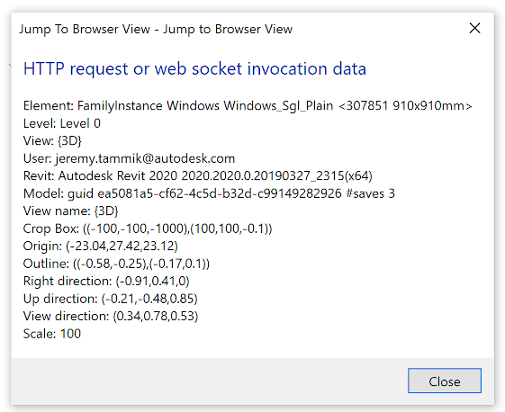

# Jump to Position in Revit

.NET C# Revit add-in setting view target and view direction to specified values.

The add-in implements several separate external commands:

- [CmdJumpToBrowserView &ndash; Jump to browser view](#cmdjumptobrowserview)
- [CmdJumpToRevitPosition &ndash; Jump to Revit Position](#cmdjumptorevitposition)
- [CmdJumpToDashboard &ndash; Jump from element to external app dashboard](#cmdjumptodashboard)
- [CmdViewListedElements &ndash; Create a new view displaying specified elements](#cmdviewlistedelements)


## <a name="cmdjumptobrowserview"><a/> CmdJumpToBrowserView &ndash; Jump to Browser View

### Task

Retrieve and provide data containing information required to jump to external database and browser view, e.g., a URL with information about what the user is looking at, like:

```
  http://www.db.com/?model=<model_name>&level=<level>&x=<x>&y=<y>&z=<z>&yaw=<yaw>&view_name=<view_name>......
```

It should include potentially useful parameters like current level viewed, view name, username, Revit version, model version, current view direction (x,y,z, front, up...), etc.

The server can interpret this link and data to display the right page and element.

### Solution

The add-in can just implement a button in Revit that launches a command that formats the data and calls the corresponding URL.

How is `yaw` defined? As described for the [three principal axes of an aircraft](https://en.wikipedia.org/wiki/Aircraft_principal_axes)?
If so, then what about `pitch` and `roll`?

The standard Revit `ViewOrientation3D` constructor takes three input arguments: `eye`, `up` and `forward` points and vectors, representing eye location point, upward direction and view direction.
The two latter must be perpendicular.

For the model version, the Revit API provides a [GetDocumentVersion method](https://www.revitapidocs.com/2020/f7a75811-b2ec-8b4c-10d3-6ed0eadf4551.htm).

DocumentVersion consists of two parts &ndash; a GUID and an integer.
The GUID is updated as new elements are created in the document, but it is not necessarily changed whenever any individual change is made to the document.
The integer is updated when the document is saved.

The GUID will change as changes are made to a model, so it should not be treated as a static value.

This class does not contain any time information &ndash; you cannot compare two DocumentVersions and know which document is newer.
It can be used to tell whether a document has changed since it was last inspected.

For a timestamp, I would use the OS file system timestamp.

Currently, the following data is gathered from the active view and selected element:




## <a name="cmdjumptorevitposition"><a/> CmdJumpToRevitPosition &ndash; Jump to Revit Position

### Task

I have a model open, and a view that I see in my external model navigator.

I want to be able to jump to this exact position within Revit, looking exactly in the same direction, i.e.:

- Go to level
- Target coordinates x=.. y=.. z=..
- Looking along this vector...

### Analysis

This is quite simple.

I believe there is no need to do anything about the level.

Here is an article
on [setting up your ViewOrientation3D](http://thebuildingcoder.typepad.com/blog/2013/04/setting-up-your-vieworientation3d.html).

If you are happy with a perspective view, I cleaned up an existing method `CreatePerspectiveViewMatchingCamera`
in [The Building Codes samples](https://github.com/jeremytammik/the_building_coder_samples) to
make it ready and suitable for use,
in [CmdNewSpotElevation.cs lines 110-174](https://github.com/jeremytammik/the_building_coder_samples/blob/master/BuildingCoder/BuildingCoder/CmdNewSpotElevation.cs#L110-L174).

### Solution

Here is a tiny plugin to do that.

- In Revit, launch the command in a 3D view
- Enter the eye position and view direction vector X, Y and Z coordinates
- Click `Jump`

The view settings jump to that position and the view refreshes.

The latter is the tricky part, in fact.

### To Do

- Rotation
- Other viewing parameters, e.g., field of view

### Implementation

#### Windows Forms TextBox XYZ Validation

The eye position and view direction vector data is entered in a text box in a Windows form.

To ensure that valid coordinates are entered that can be successfully parsed into a Revit `XYZ` object, validation is added to the form using the `TextBox` `Validating` and `Validated` events.

They require a predicate to test whether the current data can be successfully parsed into a 3D `XYZ` object.

Such a predicate is supplied by the new `ParseXyz` method:

```
    /// <summary>
    /// Parse an XYZ point or vector from a string
    /// </summary>
    public static XYZ ParseXyz( string s )
    {
      char[] delimiters = new[] { ',', ';', ' ' };

      string[] coords = s.Split( delimiters, 
        StringSplitOptions.RemoveEmptyEntries );

      double x = 0, y = 0, z = 0;
      int j = 0;

      foreach( string coord in coords )
      {
        switch( j )
        {
          case 0:
            x = Double.Parse( coord );
            break;
          case 1:
            y = Double.Parse( coord );
            break;
          case 2:
            z = Double.Parse( coord );
            break;
          default:
            break;
        }
        j++;
      }
      if( 3 != j )
      {
        throw new System.FormatException(
          "Unable to parse X, Y and Z coordinates" );
      }
      return new XYZ( x, y, z );
    }
```

#### Setting the View Orientation

The view orientation can easily be set as described in the article
on [setting up your ViewOrientation3D](http://thebuildingcoder.typepad.com/blog/2013/04/setting-up-your-vieworientation3d.html).

Its constructor takes three arguments, `eye`, `up` and `forward`.

The `up` vector must indeed be perpendicular to `forward`; otherwise, Revit will throw 
*Autodesk.Revit.Exceptions.ArgumentsInconsistentException: The vectors upDirection and forwardDirection are not perpendicular*.

In the initial version, we simply calculate `up` from `eye` and `forward` like this, also taking a vertical view direction into account:

```
    XYZ eye = form.Eye;
    XYZ forward = form.Viewdir;
  
    XYZ left = Util.IsVertical( forward )
      ? -XYZ.BasisX
      : XYZ.BasisZ.CrossProduct( forward );
  
    XYZ up = forward.CrossProduct( left );
```

Please refer to [JumpToPosition.cs](JumpToPosition/JumpToPosition.cs) for the complete implementation.

#### Refreshing the View

The view does not refresh by itself after setting the `ViewOrientation3D`.

Calling `doc.Regenerate` on its own has no effect either.

We can modify a parameter value to force a view refresh, as described in the note 
on [Setting a Parameter to Regenerate the Model](https://thebuildingcoder.typepad.com/blog/2017/11/cloud-model-predicate-and-set-parameter-regenerates.html#3).

I searched for a parameter that changes as little as possible in the model to avoid performance costs.

I initially tried to use the view `Name`. That works and does trigger a view refresh.

Unfortunately, if the original view name is "{3D}", we are unable to reset it after changing it, because it contains invalid characters.

Next, I tried toggling the 'far bound active' on and off, and that works as well.

Please refer to [JumpToPosition.cs](JumpToPosition/JumpToPosition.cs) for the complete implementation.


## <a name="cmdjumptodashboard"><a/> CmdJumpToDashboard &ndash; Jump from Element to External App Dashboard

Task: populate all elements with an additional property `url_dashboard`.
On launching the `CmdJumpToDashboard` command, picking a given element launches the browser with the associated URL.

There are two main ways to add information to a Revit element: in a parameter or using extensible storage.
The extensible storage is only accessible via the add-in, and access can be restricted.
The parameter can or cannot be made user visible and user editable, in the element property panel.
Which one shall we use?

Initially, Revit had no API.
Shared parameters were added as a way for end users to add their information to the BIM.
They have a UI.
Revit interacts with the data and it can be used for scheduling, etc.
The API for shared params is fiddly, since added afterwards.

Extensible storage was created as an API thing only.
No UI whatsoever.
Revit does not interact with the data at all.
The add-in has complete responsibility.
Here are [several discussions about extensible storage](https://thebuildingcoder.typepad.com/blog/about-the-author.html#5.23).

Neither is particularly tricky to implement.

If the data is purely intended for internal add-in use, extensible storage is normally the better way to go, and that is probably the case here.

The user never needs to see or edit the URL, or be allowed to tweak it?
If so, a shared parameter would simplify that.
But, it would also clutter up the list of element properties...

The user probably need no interaction with the URL, and, even if she did, it could be exposed and implemented by the add-in, e.g "show latest image", "show schedule info", and so on.

[Q] Can different add-ins be enabled to interact with the same data?

[A] Access to extensible storage date can restricted to: the specific add-in that created it, the add-in vendor, or all.
For the sake of simplicity, I would go for 'all', unless there is a compelling need.
An add-in can impersonate another add-in to read its extensible storage anyway, cf. [trouble reading entity schema](https://forums.autodesk.com/t5/revit-api-forum/trouble-reading-entity-schema/m-p/9046186).

[Q] Can the add-in expose info to the user in the Revit UI without the user having to press any button, e.g., to show the dashboard URL or "were any errors encountered building this element"?

[A] it is possible &ndash; but a little bit tricky and unreliable &ndash; to display any data you want in [your own custom tooltip](http://thebuildingcoder.typepad.com/blog/2012/10/uiview-windows-coordinates-referenceintersector-and-my-own-tooltip.html).

Most other solutions would require a click, e.g., like in
the [modeless pressure drop tool](https://thebuildingcoder.typepad.com/blog/2009/10/modeless-pressure-drop-tool.html).

There may be other possibilities as well... display a text in the Revit status bar, for instance.

All doable, but not super simple, and maybe a bit costly, performance-wise.

OK, I see the problem with the custom tooltips.
Let's keep it as "on plugin click".

Next thought, pondering how to populate the `url_dashboard` property on all the elements...

Is there even any need at all to specify such a thing?

Maybe a much simpler approach would be to use the existing element data, e.g., element id or element unique id, and simply append that to a constant base URL.

So, if the base URL is something like `http://myexternalapp.com/dashboard/element`, the add-in could simply launch the browser and specify that base URL with an element id or unique id appended to it.

That would save the entire discussion above on this topic, and simplify things quite significantly.


## <a name="cmdviewlistedelements"><a/> CmdViewListedElements &ndash; Create a New View Displaying Specified Elements

Task: Given a file with a list of element ids and a level id, create a new view where only these elements are visible in the given level.

The command input is specified via a hardcoded file path, `C:/tmp/revit_view_creator_config.json`.
Here is a sample JSON input file that explains how the format is defined:

```
  {
    "id_level" : 311,
    "ids_to_show" : [307847, 307849]
  }
```

The specified level has a plan view associated with it.
This view is duplicated.

The new view is named by appending the number of elements to display and the current date in ISO format to the original view name, e.g., `Level 0_showing_2_elements_2019-11-09`.

In the new view, all elements listed in `ids_to_show` are unhidden and all elements not listed there are hidden.
